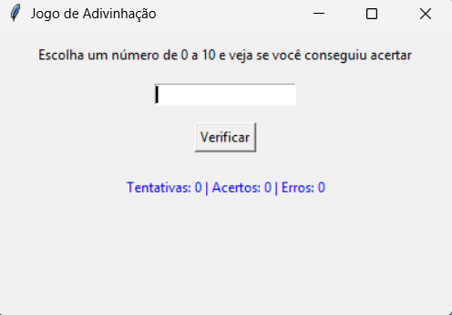

# 🎯 Jogo de Adivinhação em Python

Este é um jogo interativo feito com Python e Tkinter, onde o usuário tenta adivinhar um número secreto entre 0 e 10. O jogo registra estatísticas como acertos, erros e número de tentativas.

## 📌 Funcionalidades

- Interface gráfica simples com Tkinter.
- Entrada via botão **Verificar** ou tecla **Enter**.
- Número secreto aleatório entre 0 e 10 a cada rodada.
- Exibição em tempo real das estatísticas:
  - Total de tentativas
  - Quantidade de acertos
  - Quantidade de erros

## 💻 Pré-requisitos

Este programa usa apenas bibliotecas padrão do Python. Ou seja, **não é necessário instalar nada** adicional se você já tiver o Python instalado.

- Python 3.7 ou superior
- Tkinter (já incluso no Python para Windows/macOS; no Linux, instale com `sudo apt-get install python3-tk`)

## ▶️ Como executar

1. Clone o repositório:

```bash
git clone https://github.com/seu-usuario/jogo-adivinhacao-python.git
cd jogo-adivinhacao-python
```

## 🧠 Como jogar
Digite um número entre 0 e 10.

Pressione Enter ou clique em "Verificar".

Veja se acertou ou não.

O jogo gera automaticamente um novo número após cada tentativa.

## 📸 Exemplo da interface
